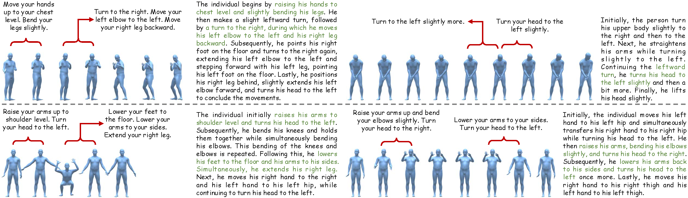

# FineMotion: A Dataset and Benchmark with both Spatial and Temporal Annotation for Fine-grained Motion Generation and Editing

FineMotion provides strictly aligned, fine-grained descriptions of human body part movements (BPM) for both motion snippets (short segments of motion sequences) and entire motion sequences, with motions sourced from [HumanML3D](https://github.com/EricGuo5513/HumanML3D/)).

    
  

 

## Dataset
  
We released our dataset in the author's official repository, please visit [FineMotion_release](https://github.com/BizhuWu/FineMotion).
